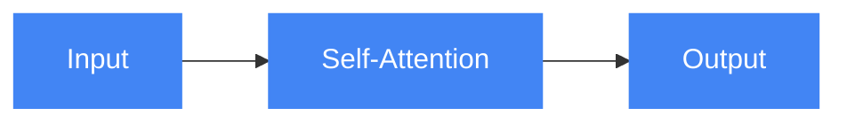
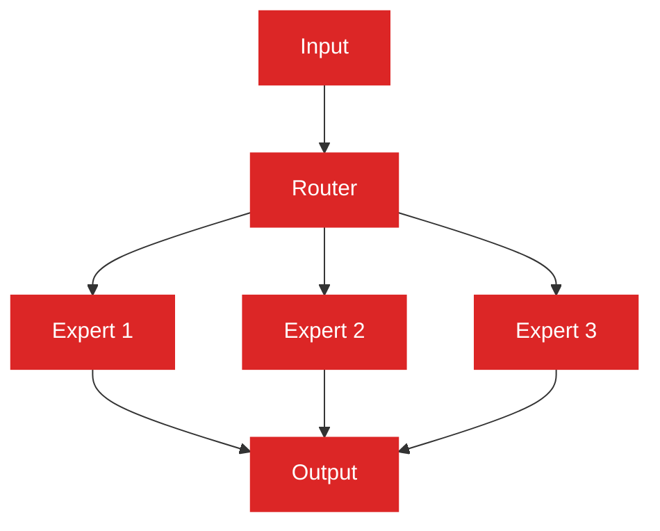

# LLM Architecture Patterns

Explore common architectural patterns for building robust and scalable LLM-powered applications. This directory contains documentation and implementations of the most important LLM architecture patterns used in modern AI systems.

## Key Architecture Patterns

### [Transformer Architecture](transformer-architecture.md)

The foundational architecture using self-attention mechanisms that revolutionized NLP.

**Key Features:**
- Multi-head self-attention mechanism
- Positional encoding to capture sequence information
- Residual connections and layer normalization
- Feed-forward networks between attention layers

**Implementation:** [transformer_implementation.py](transformer_implementation.py)

### [Decoder-only Models](decoder-only-models.md)

GPT-style architectures focused on text generation (GPT-4, Claude, Llama).

**Key Features:**
- Causal (unidirectional) attention masks
- Autoregressive next-token prediction
- Pre-norm layer arrangement
- Text generation capabilities

**Implementation:** [decoder_only_implementation.py](decoder_only_implementation.py)

### [Encoder-only Models](encoder-only-models.md)

BERT-style architectures focused on understanding (good for embeddings).

**Key Features:**
- Bidirectional attention mechanism
- Masked language modeling objective
- Token and sentence-level representations
- Specialized for understanding tasks

**Implementation:** [encoder_only_implementation.py](encoder_only_implementation.py)

### [Encoder-Decoder Models](encoder-decoder-models.md)

T5-style architectures for translation and summarization tasks.

**Key Features:**
- Separate encoder and decoder components
- Cross-attention between encoder and decoder
- Sequence-to-sequence capabilities
- Ideal for translation and summarization

**Implementation:** [encoder_decoder_implementation.py](encoder_decoder_implementation.py)

### [Mixture of Experts](mixture-of-experts.md)

Models like Mixtral with specialized subnetworks activated based on input.

**Key Features:**
- Dynamic routing of tokens to experts
- Sparsely activated expert networks
- Increased parameter efficiency
- Scaling capability without proportional compute

**Implementation:** [mixture_of_experts_implementation.py](mixture_of_experts_implementation.py)

### [Sparse Attention Mechanisms](sparse-attention-mechanisms.md)

Alternate attention patterns to reduce computational complexity.

**Key Features:**
- Reduced attention computation for long sequences
- Local, global, and strided attention patterns
- Locality-sensitive hashing techniques
- Linear or near-linear scaling with sequence length

**Implementation:** [sparse_attention_implementation.py](sparse_attention_implementation.py)

## Implementation Details

Each architecture implementation includes:

1. **Core Components** - Detailed implementation of key architectural elements
2. **Complete Model** - Full model assembly with all necessary components
3. **Usage Examples** - Sample code demonstrating how to use the implementation
4. **Utility Functions** - Helper functions for common operations

## Choosing the Right Architecture

| Architecture | Best For | Key Advantage | Typical Use Cases |
|--------------|----------|---------------|-------------------|
| Transformer | General foundation | Versatility | Building block for other architectures |
| Decoder-only | Text generation | Autoregressive capabilities | Chatbots, content creation, code generation |
| Encoder-only | Understanding text | Rich representations | Classification, embeddings, search |
| Encoder-Decoder | Text transformation | Sequence mapping | Translation, summarization, rewriting |
| Mixture of Experts | Efficient scaling | Parameter efficiency | Large-scale models with specialized capabilities |
| Sparse Attention | Long sequences | Computational efficiency | Document processing, long-context tasks |

## Performance Considerations

- **Computational Requirements**: Different architectures have varying computational needs
- **Memory Usage**: Attention mechanisms can have significant memory requirements
- **Inference Speed**: Generation speed varies based on architecture design
- **Scaling Properties**: Consider how the architecture scales with model size
- **Hardware Optimization**: Some architectures are better suited for specific hardware

## Advanced Topics

- [Architecture Fusion](architecture-fusion.md) - Combining multiple architectures
- [Efficient Implementation](efficient-implementation.md) - Optimizing for performance
- [Quantization Strategies](quantization-strategies.md) - Reducing precision for efficiency
- [Architectural Innovations](architectural-innovations.md) - Recent developments

## Further Reading

- [Attention Is All You Need](https://arxiv.org/abs/1706.03762) - Original Transformer paper
- [Language Models are Few-Shot Learners](https://arxiv.org/abs/2005.14165) - GPT-3 paper
- [BERT: Pre-training of Deep Bidirectional Transformers](https://arxiv.org/abs/1810.04805)
- [Exploring the Limits of Transfer Learning with a Unified Text-to-Text Transformer](https://arxiv.org/abs/1910.10683) - T5 paper
- [Switch Transformers: Scaling to Trillion Parameter Models with Simple and Efficient Sparsity](https://arxiv.org/abs/2101.03961)
