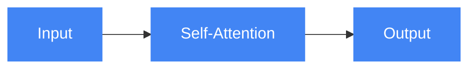
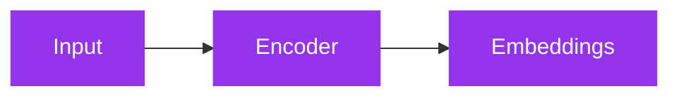
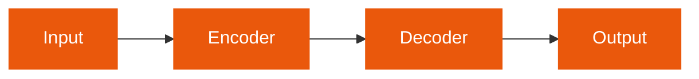
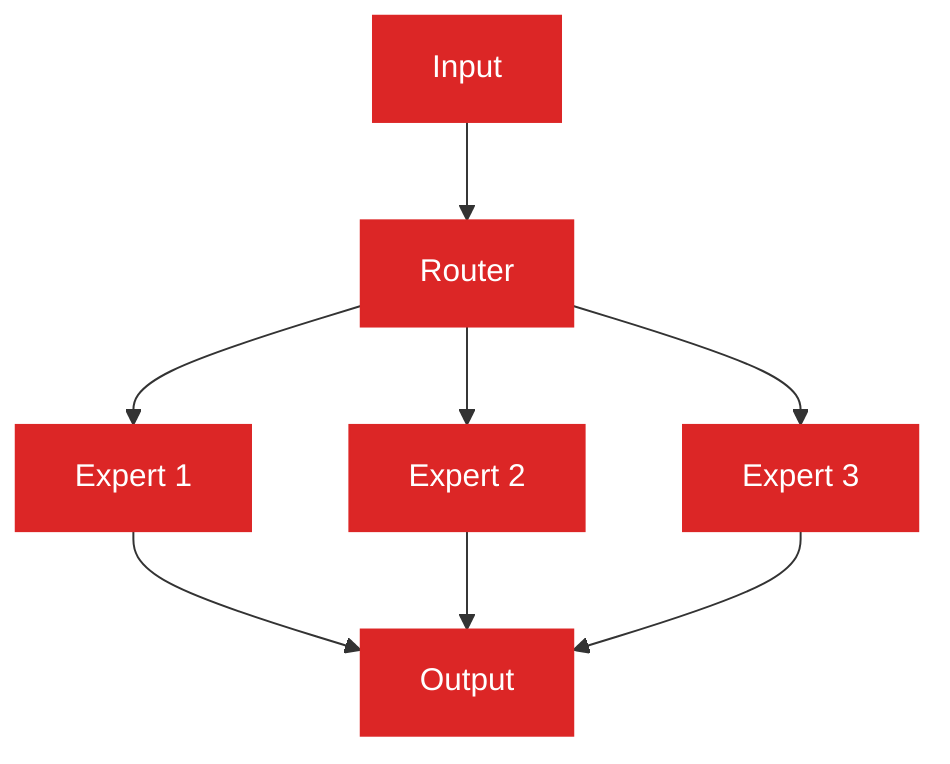
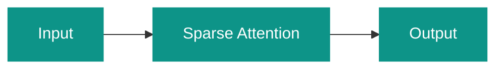

# LLM Architecture

Explore common architectural patterns for building robust and scalable LLM-powered applications.

## Transformer Architecture (Foundation)

The foundational architecture using self-attention mechanisms that revolutionized NLP.

## Decoder-only Models (GPT-style)

GPT-style architectures focused on text generation (GPT-4, Claude, Llama).

## Encoder-only Models (BERT-style)

BERT-style architectures focused on understanding (good for embeddings).

## Encoder-Decoder Models (T5-style)

T5-style architectures for translation and summarization tasks.

## Mixture of Experts (Mixtral)

Models like Mixtral with specialized subnetworks activated based on input.

## Sparse Attention Mechanisms (Efficiency)

Alternate attention patterns to reduce computational complexity.

Each pattern is optimized for specific use cases:
- **Transformer**: General-purpose foundation for NLP tasks
- **Decoder-only**: Text generation and completion
- **Encoder-only**: Understanding and embeddings
- **Encoder-Decoder**: Translation and summarization
- **Mixture of Experts**: Specialized task handling
- **Sparse Attention**: Efficient processing of long sequences
