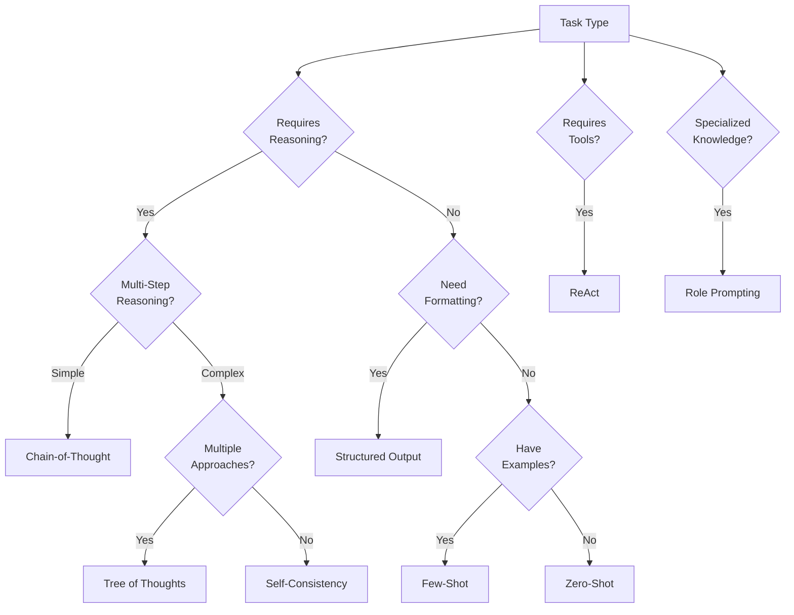

# LLM Prompting Techniques 🧠

A comprehensive collection of advanced prompting techniques for Large Language Models (LLMs). This directory contains detailed guides, code examples, and best practices to help you get the most out of your interactions with LLMs.

## Prompting Techniques Overview

### Fundamental Techniques

| Technique | Description | Best For | Example |
|-----------|-------------|----------|---------|
| [**Zero-Shot Prompting**](./zero-shot-prompting.md) | Making LLMs perform tasks without examples | Simple tasks; testing baseline capabilities | `Summarize this article in 3 bullet points: [article]` |
| [**Few-Shot Prompting**](./few-shot-prompting.md) | Providing examples to guide model responses | Consistent formatting; specific patterns | `Example 1: [input] → [output] ... Your turn: [input]` |
| [**Chain-of-Thought**](./chain-of-thought.md) | Encouraging step-by-step reasoning | Complex problem-solving; logical reasoning | `Let's think through this step by step...` |
| [**Role Prompting**](./role-prompting.md) | Assigning specific personas to guide behavior | Specialized knowledge; consistent tone | `You are an expert physicist explaining...` |

### Advanced Reasoning Techniques

| Technique | Description | Best For | Example |
|-----------|-------------|----------|---------|
| [**Tree of Thoughts**](./tree-of-thoughts.md) | Exploring multiple reasoning paths | Complex problems with multiple approaches | Generating alternative solutions and evaluating each branch |
| [**Self-Consistency**](./self-consistency.md) | Multiple reasoning paths with voting | Improving accuracy on ambiguous problems | Solving the same problem multiple ways and taking the most common answer |
| [**ReAct Prompting**](./react-prompting.md) | Reasoning and Acting cycles | Tasks requiring tool use and reasoning | Thought → Action → Observation loops |
| [**Automatic Reasoning and Tool-use**](./art-prompting.md) | Systematic decomposition and tool integration | Complex workflows with external tools | Breaking down tasks and selecting appropriate tools |

### Specialized Techniques

| Technique | Description | Best For | Example |
|-----------|-------------|----------|---------|
| [**Structured Output**](./structured-output.md) | Getting responses in specific formats | API integration; data extraction | JSON, XML, or custom structured formats |
| [**System Prompts**](./system-prompts.md) | Setting overall behavior and context | Consistent persona; global constraints | Setting the model's role and behavioral guidelines |
| [**Prompt Chaining**](./prompt-chaining.md) | Breaking complex tasks into sequences | Multi-stage workflows; complex generation | Using output from one prompt as input to another |
| [**Retrieval-Augmented Generation**](./retrieval-augmented-generation.md) | Enhancing responses with external info | Knowledge-intensive tasks; factual accuracy | Retrieving relevant information to include in context |

### Optimization Techniques

| Technique | Description | Best For | Example |
|-----------|-------------|----------|---------|
| [**Automatic Prompt Engineering**](./automatic-prompt-engineering.md) | Using LLMs to generate and optimize prompts | Prompt optimization; discovering effective techniques | Meta-prompting to create better prompts |
| [**Directional Stimulus Prompting**](./directional-stimulus-prompting.md) | Guiding responses in specific directions | Controlling response characteristics | Steering generation toward specific tones or styles |
| [**Multimodal Prompting**](./multimodal-prompting.md) | Working with multiple types of media | Vision-language tasks; mixed-media analysis | Combining image and text prompts |
| [**Agent Prompting**](./agent-prompting.md) | Creating autonomous task-performing systems | Complex, multi-step objectives | Self-directed task completion systems |

## Selecting the Right Technique

Choosing the appropriate prompting technique depends on your specific use case:



## Combining Techniques for Better Results

Many of these techniques can be combined to create even more powerful prompting strategies:

- **Zero-Shot CoT**: Zero-shot prompting with "Let's think step by step"
- **Few-Shot CoT**: Providing examples of step-by-step reasoning
- **Role + CoT**: Assigning an expert role and requesting step-by-step thinking
- **ReAct + Structured Output**: Combining tool use with structured response formats
- **RAG + CoT**: Retrieving information and reasoning through it methodically
- **Agent + ToT**: Creating agents that explore multiple solution paths

## Implementation Best Practices

1. **Start Simple**
   - Begin with the simplest technique that might work (usually zero-shot)
   - Only add complexity when needed

2. **Iteration is Key**
   - Test different prompting approaches
   - Refine based on response quality
   - A/B test variations for critical applications

3. **Consider Model Capabilities**
   - Larger models (>70B parameters) typically handle advanced techniques better
   - Smaller models may need more explicit instructions and examples

4. **Manage Token Usage**
   - Complex techniques use more tokens
   - Consider cost vs. performance tradeoffs
   - Use truncation and summarization for long contexts

5. **Evaluate Systematically**
   - Define clear metrics for success
   - Compare different techniques on the same tasks
   - Test on diverse inputs to ensure robustness

## Common Patterns and Anti-Patterns

### Effective Patterns
- Explicit, clear instructions
- Breaking complex tasks into steps
- Providing context and constraints
- Consistent formatting
- Using delimiters to separate sections

### Anti-Patterns to Avoid
- Vague or ambiguous instructions
- Contradictory guidance
- Excessive examples that consume context
- Overly complex prompt structures
- Assuming capabilities the model doesn't have

## Code Examples

Each technique documentation includes implementation examples in JavaScript and Python. For example:

```javascript
// Chain-of-Thought example
import { generateText } from 'ai';

const response = await generateText({
  model: "claude-3-opus-20240229",
  prompt: `Solve this step by step:
  
  If a shirt normally costs $25 and is on sale for 20% off, 
  then I buy 3 of these shirts using a $10 coupon, 
  how much do I pay in total?`,
  temperature: 0.2,
});

console.log(response.text);
```

```python
# Few-Shot example
from openai import OpenAI

client = OpenAI()

response = client.chat.completions.create(
    model="gpt-4",
    messages=[
        {"role": "system", "content": "You translate English to French."},
        {"role": "user", "content": "English: Hello\nFrench: Bonjour"},
        {"role": "user", "content": "English: How are you?\nFrench: Comment allez-vous?"},
        {"role": "user", "content": "English: Where is the library?\nFrench:"}
    ],
    temperature=0.1,
)

print(response.choices[0].message.content)
```

## Further Resources

- [Anthropic Claude Documentation](https://docs.anthropic.com/claude/docs/introduction-to-prompting)
- [OpenAI Cookbook](https://github.com/openai/openai-cookbook)
- [Prompt Engineering Guide](https://www.promptingguide.ai/)
- [LangChain Documentation](https://js.langchain.com/docs/)

## Research Papers

- [Chain-of-Thought Prompting Elicits Reasoning in Large Language Models](https://arxiv.org/abs/2201.11903) (Wei et al., 2022)
- [Tree of Thoughts: Deliberate Problem Solving with Large Language Models](https://arxiv.org/abs/2305.10601) (Yao et al., 2023)
- [ReAct: Synergizing Reasoning and Acting in Language Models](https://arxiv.org/abs/2210.03629) (Yao et al., 2022)
- [Large Language Models are Zero-Shot Reasoners](https://arxiv.org/abs/2205.11916) (Kojima et al., 2022)
- [Least-to-Most Prompting Enables Complex Reasoning in Large Language Models](https://arxiv.org/abs/2205.10625) (Zhou et al., 2022)
- [Self-Consistency Improves Chain of Thought Reasoning in Language Models](https://arxiv.org/abs/2203.11171) (Wang et al., 2022)

## Contributing

We welcome contributions! Feel free to:
- Suggest improvements to existing techniques
- Add new prompting techniques as they emerge
- Contribute code examples in different languages
- Share performance benchmarks

Please see our [Contributing Guidelines](../CONTRIBUTING.md) for more details.
